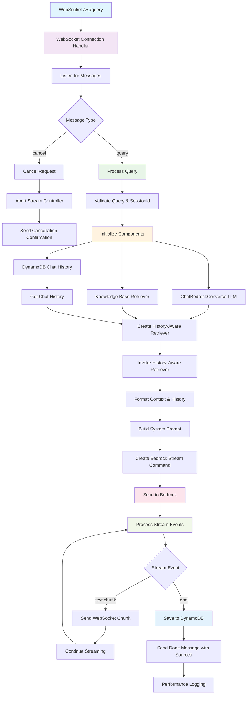

# Bedrock Routes Diagram



## Description
WebSocket endpoint for real-time knowledge base querying with conversational memory. Supports streaming responses and request cancellation.

## User Flow

```
[User] (via Chat UI)
   ↓
WebSocket Connection → `/ws/query`
   ↓
LangChainJS stack:
   • ChatBedrockConverse (LLM)
   • DynamoDBChatMessageHistory
   • AmazonKnowledgeBaseRetriever (Bedrock KB)
   • createHistoryAwareRetriever (LangChain)
   ↓
Prompt construction:
   • Truncated context from retrieved docs
   • Recent conversation history
   • Business-aligned system prompt
   ↓
AWS Bedrock `RetrieveAndGenerateStreamCommand`
   ↓
Response streamed token-by-token via WebSocket
   ↓
Frontend renders in real-time
   ↓
Final result + source docs
```

## Key Features
- **Conversational Memory**: Uses DynamoDB to store chat history per session
- **Streaming**: Real-time token streaming via WebSocket
- **Cancellation**: Ability to cancel in-progress requests
- **Context-Aware**: Uses LangChain history-aware retriever
- **Performance Tracking**: Detailed timing metrics for each phase

## Message Format
### Input
```json
{
  "sessionId": "unique-session-id",
  "query": "your question here"
}
```

### Output (Streaming)
```json
{"type": "chunk", "data": "text token"}
{"type": "done", "sources": [...]}
```

### Cancellation
```json
{"type": "cancel", "sessionId": "session-id"}
```