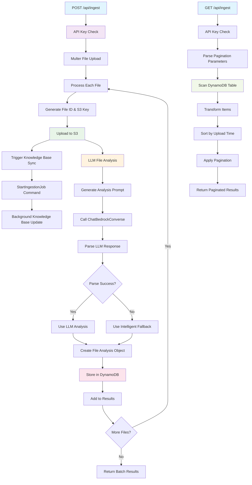

# Ingestion Routes Diagram



## Description
File ingestion system that uploads files to S3, analyzes them with AI, and stores metadata in DynamoDB.

## User Flow - POST /api/ingest

```
[User] (via File Upload UI)
   ↓
HTTP POST → `/api/ingest` (with files)
   ↓
API Key validation
   ↓
Multer file processing (up to 1GB per file)
   ↓
For each file:
   • Generate UUID & S3 key
   • Upload to S3 with metadata
   • Trigger Bedrock Knowledge Base sync (async)
   • AI analysis with ChatBedrockConverse
   ↓
Commercial intelligence extraction:
   • Market access themes
   • HEOR insights
   • Competitive analysis
   • Physician profiling data
   ↓
Structured metadata → DynamoDB
   ↓
Batch response with analysis results
```

## User Flow - GET /api/ingest

```
[User] (via File Management UI)
   ↓
HTTP GET → `/api/ingest?page=1&pageCount=20`
   ↓
API Key validation
   ↓
DynamoDB scan with pagination
   ↓
Sort by upload timestamp (newest first)
   ↓
Return paginated file metadata
```

## POST /api/ingest Features
- **Multi-file Upload**: Supports batch file uploads
- **AI Analysis**: Uses Claude to analyze file content and extract commercial intelligence
- **S3 Storage**: Stores original files in S3 with metadata
- **DynamoDB Metadata**: Stores structured analysis results
- **Knowledge Base Sync**: Automatically triggers AWS Bedrock knowledge base updates
- **Intelligent Fallbacks**: Uses filename-based analysis when AI parsing fails

## GET /api/ingest Features
- **Pagination**: Supports page-based pagination
- **Sorting**: Returns files sorted by upload time (newest first)
- **Filtering**: Can be extended for content type or topic filtering

## File Analysis Structure
```json
{
  "id": "uuid",
  "name": "filename.pdf",
  "type": "Commercial Intelligence Report",
  "summary": "Business-focused summary",
  "key_topics": ["market access", "pricing"],
  "data_classification": "Market Access Intelligence",
  "s3_key": "uploads/2024-01-01/filename.pdf",
  "upload_timestamp": "2024-01-01T12:00:00Z"
}
```

## Commercial Intelligence Themes
- Market Access (payor coverage, formulary positioning)
- HEOR (Health Economics & Outcomes Research)
- Omnichannel Engagement (HCP interactions)
- Patient Journey (treatment pathways)
- Physician Profiling (prescriber behavior)
- Pricing/GTN (gross-to-net, pricing strategy)
- Competitive Intelligence (market share analysis)