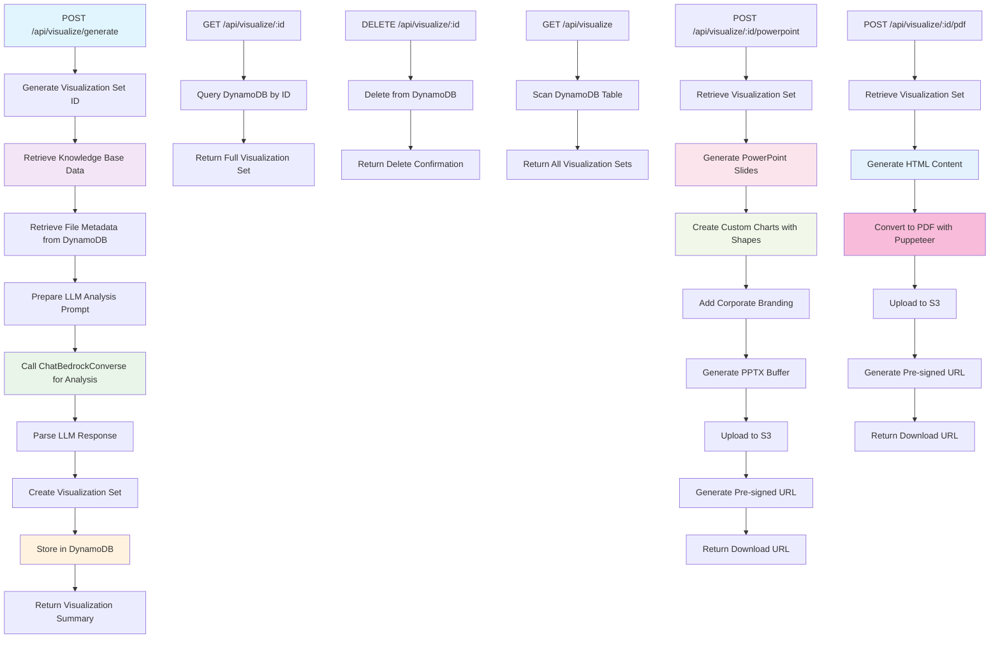

# Visualization Routes Diagram



## Description
Comprehensive visualization system that generates executive-ready charts, insights, and export capabilities.

## User Flow - POST /api/visualize/generate

```
[User] (via Dashboard UI)
   ↓
HTTP POST → `/api/visualize/generate`
   ↓
Knowledge base data retrieval:
   • AmazonKnowledgeBaseRetriever (topK=20)
   • DynamoDB file metadata scan
   ↓
LLM analysis with ChatBedrockConverse:
   • Commercial intelligence focus
   • Executive-level insights
   • 4 chart types (bar, line, pie, radar)
   ↓
Visualization set creation:
   • Business-relevant titles
   • Actionable recommendations
   • Performance metrics
   ↓
DynamoDB storage → Return summary
```

## User Flow - POST /api/visualize/:id/powerpoint

```
[User] (via Export UI)
   ↓
HTTP POST → `/api/visualize/:id/powerpoint`
   ↓
Retrieve visualization set from DynamoDB
   ↓
PowerPoint generation:
   • Corporate branding (Starfire theme)
   • Custom charts with shapes
   • Executive summary slides
   • Two-column layout
   ↓
Upload PPTX → S3
   ↓
Generate pre-signed URL → Return download link
```

## User Flow - POST /api/visualize/:id/pdf

```
[User] (via Export UI)
   ↓
HTTP POST → `/api/visualize/:id/pdf`
   ↓
Retrieve visualization set from DynamoDB
   ↓
PDF generation:
   • HTML content creation
   • Puppeteer rendering
   • Professional styling
   • Multi-page report
   ↓
Upload PDF → S3
   ↓
Generate pre-signed URL → Return download link
```

## POST /api/visualize/generate Features
- **Auto-Analysis**: Automatically analyzes knowledge base data
- **Executive Focus**: Generates business-relevant insights for pharmaceutical commercial teams
- **Multiple Charts**: Creates 4 different visualization types (bar, line, pie, radar)
- **Commercial Intelligence**: Focuses on market access, HEOR, competitive analysis
- **Persistent Storage**: Saves visualization sets in DynamoDB for later retrieval

## Visualization Export Features

### PowerPoint Generation
- **Corporate Branding**: Starfire-themed slides with consistent styling
- **Native Charts**: Custom chart rendering using shapes and visual elements
- **Two-Column Layout**: Charts on left, insights/recommendations on right
- **Executive Summary**: Cover page and summary slides
- **Professional Format**: Suitable for C-suite presentations

### PDF Generation
- **Multi-Page Report**: Comprehensive document with cover page
- **HTML-to-PDF**: Uses Puppeteer for high-quality rendering
- **Structured Layout**: Professional formatting with charts and data tables
- **Fallback Support**: Uses jsPDF when Puppeteer fails
- **Executive Ready**: Suitable for board presentations and reports

## Chart Types Supported
- **Bar Charts**: Category comparisons and rankings
- **Line Charts**: Trend analysis and time series
- **Pie Charts**: Market share and distribution analysis
- **Radar Charts**: Multi-dimensional performance analysis
- **Data Tables**: Structured data presentation

## Commercial Intelligence Themes
- **Market Access**: Payor coverage patterns and formulary positioning
- **Brand Performance**: Sales metrics and competitive benchmarking
- **HEOR Evidence**: Cost-effectiveness and clinical outcomes
- **Physician Profiling**: Prescriber behavior and targeting insights
- **Competitive Intelligence**: Market share and competitor analysis
- **Pricing Strategy**: GTN analysis and pricing optimization

## API Response Structure
```json
{
  "visualizationSetId": "uuid",
  "title": "Medicare Drug Utilization Analysis Q2 2025",
  "summary": "Executive summary of key findings",
  "visualizationCount": 4,
  "metadata": {
    "documentsAnalyzed": 20,
    "filesReferenced": 15,
    "processingTime": 5000
  }
}
```